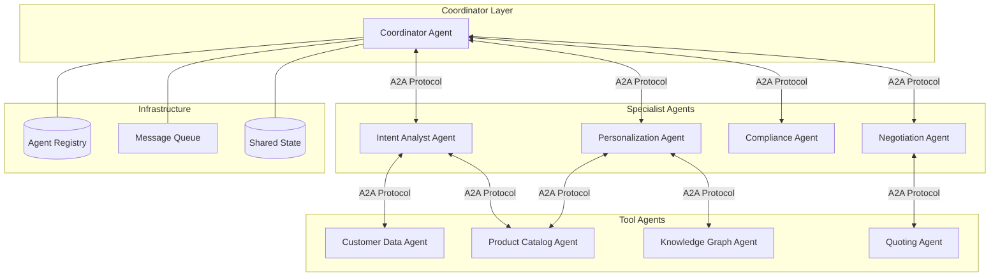
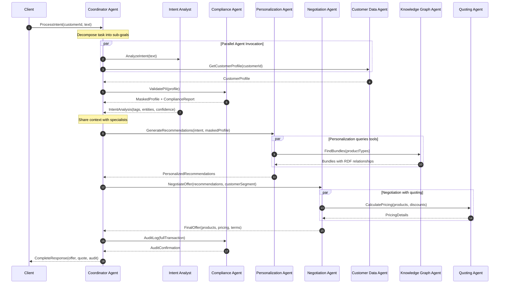
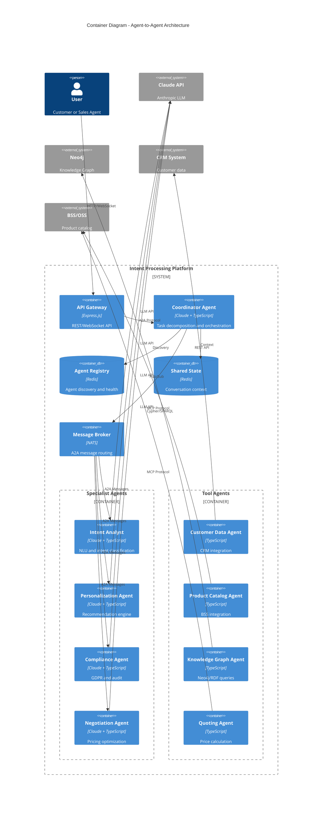
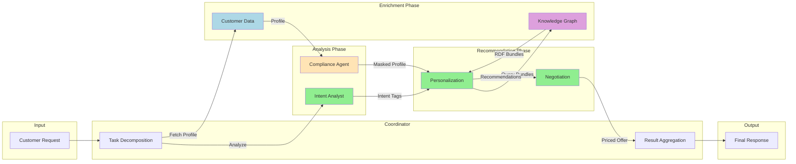

# Agent-to-Agent (A2A) Architecture Proposal

## Overview

This document proposes evolving the Intent Processing Platform from a single-orchestrator model to a **multi-agent architecture** where specialized AI agents communicate directly with each other to collaboratively solve customer intent problems.

## Current vs Proposed Architecture

### Current: Single Orchestrator Model
```
Client → IntentProcessor → [MCP Services] → Claude LLM → Response
```
- Single point of orchestration
- Sequential processing
- LLM used for reasoning, MCP for data

### Proposed: Multi-Agent Collaborative Model
```
Client → Coordinator Agent ↔ [Specialist Agents] ↔ [Tool Agents] → Response
                    ↕              ↕                    ↕
              Agent Registry    A2A Protocol        MCP Services
```
- Distributed intelligence
- Parallel agent collaboration
- Each agent has specialized capabilities

---

## Agent Architecture

### Agent Types



### Agent Descriptions

| Agent | Role | Capabilities | LLM Powered |
|-------|------|--------------|-------------|
| **Coordinator Agent** | Orchestrates multi-agent workflows | Task decomposition, agent selection, result aggregation | Yes |
| **Intent Analyst Agent** | Understands customer needs | NLU, intent classification, entity extraction | Yes |
| **Personalization Agent** | Tailors recommendations | Customer profiling, preference learning, offer optimization | Yes |
| **Compliance Agent** | Ensures regulatory compliance | GDPR validation, PII detection, audit logging | Yes |
| **Negotiation Agent** | Handles pricing and discounts | Dynamic pricing, discount rules, approval workflows | Yes |
| **Customer Data Agent** | Retrieves customer information | CRM integration, profile aggregation | No (Tool) |
| **Product Catalog Agent** | Searches products | Catalog search, availability check | No (Tool) |
| **Knowledge Graph Agent** | Discovers relationships | RDF/SPARQL queries, bundle discovery | No (Tool) |
| **Quoting Agent** | Generates quotes | Price calculation, quote generation | No (Tool) |

---

## A2A Communication Protocol

### Message Format

```typescript
interface A2AMessage {
  // Header
  messageId: string;
  correlationId: string;      // Links related messages
  timestamp: string;

  // Routing
  from: AgentIdentity;
  to: AgentIdentity;
  replyTo?: string;           // For async responses

  // Payload
  type: 'request' | 'response' | 'event' | 'error';
  intent: string;             // What the sender wants
  content: any;               // Structured payload

  // Context
  conversationId: string;     // Multi-turn context
  parentMessageId?: string;   // For threaded conversations
  context: SharedContext;     // Accumulated state

  // Metadata
  priority: 'low' | 'normal' | 'high' | 'critical';
  ttl: number;                // Time to live in ms
  capabilities: string[];     // Required agent capabilities
}

interface AgentIdentity {
  agentId: string;
  agentType: string;
  version: string;
  endpoint: string;
}

interface SharedContext {
  customerId?: string;
  sessionId: string;
  accumulatedFacts: Record<string, any>;
  decisions: Decision[];
  constraints: Constraint[];
}
```

### Agent Card (Discovery)

Each agent publishes an **Agent Card** for discovery:

```json
{
  "agentId": "intent-analyst-001",
  "name": "Intent Analyst Agent",
  "description": "Analyzes customer intents using NLU",
  "version": "2.0.0",
  "capabilities": [
    "intent_classification",
    "entity_extraction",
    "sentiment_analysis",
    "multi_turn_context"
  ],
  "protocols": ["a2a/1.0", "mcp/1.0"],
  "endpoint": "https://agents.internal/intent-analyst",
  "authentication": {
    "type": "oauth2",
    "tokenUrl": "https://auth.internal/token"
  },
  "rateLimit": {
    "requestsPerMinute": 100,
    "maxConcurrent": 10
  },
  "sla": {
    "maxLatencyMs": 500,
    "availability": 99.9
  }
}
```

---

## Sequence Diagram: Multi-Agent Intent Processing



---

## C4 Container Diagram: A2A Architecture



---

## Data Flow: Agent Collaboration



---

## Agent Communication Patterns

### 1. Request-Response (Synchronous)

```typescript
// Coordinator requests intent analysis
const response = await intentAgent.send({
  type: 'request',
  intent: 'analyze_customer_intent',
  content: {
    text: 'Need fast internet for working from home',
    context: sharedContext
  }
});
```

### 2. Publish-Subscribe (Async Events)

```typescript
// Compliance agent publishes audit event
await messageBroker.publish('audit.completed', {
  type: 'event',
  intent: 'audit_logged',
  content: {
    transactionId: 'TXN-123',
    complianceStatus: 'passed',
    timestamp: new Date().toISOString()
  }
});
```

### 3. Task Delegation Chain

```typescript
// Coordinator delegates with continuation
const workflow = new AgentWorkflow()
  .step(intentAgent, 'analyze')
  .step(complianceAgent, 'validate')
  .parallel([
    [personalizationAgent, 'recommend'],
    [knowledgeGraphAgent, 'findBundles']
  ])
  .step(negotiationAgent, 'price')
  .aggregate(coordinatorAgent, 'finalize');

const result = await workflow.execute(customerRequest);
```

### 4. Consensus Protocol (Multi-Agent Agreement)

```typescript
// Multiple agents vote on recommendation
const consensus = await coordinatorAgent.seekConsensus({
  question: 'Best bundle for customer segment: Young Professional',
  voters: [personalizationAgent, negotiationAgent, complianceAgent],
  threshold: 0.66,  // 2/3 majority
  timeout: 5000
});
```

---

## Benefits of A2A Architecture

| Aspect | Single Orchestrator | Multi-Agent A2A |
|--------|---------------------|-----------------|
| **Scalability** | Limited by orchestrator | Horizontal scaling per agent |
| **Specialization** | General-purpose prompts | Domain-expert agents |
| **Fault Tolerance** | Single point of failure | Graceful degradation |
| **Latency** | Sequential processing | Parallel agent execution |
| **Maintainability** | Monolithic prompts | Modular agent updates |
| **Observability** | Single trace | Per-agent metrics |
| **Cost Optimization** | One LLM for all | Right-sized LLMs per agent |

---

## Implementation Roadmap

### Phase 1: Agent Framework (Week 1-2)
- [ ] Define A2A message protocol
- [ ] Implement Agent base class
- [ ] Create Agent Registry service
- [ ] Set up NATS message broker

### Phase 2: Core Agents (Week 3-4)
- [ ] Migrate IntentProcessor to Coordinator Agent
- [ ] Extract Intent Analyst Agent
- [ ] Extract Compliance Agent
- [ ] Implement shared context store

### Phase 3: Specialist Agents (Week 5-6)
- [ ] Implement Personalization Agent
- [ ] Implement Negotiation Agent
- [ ] Add agent-to-agent discovery
- [ ] Implement workflow engine

### Phase 4: Tool Agent Migration (Week 7-8)
- [ ] Wrap MCP services as Tool Agents
- [ ] Add MCP-to-A2A bridge
- [ ] Implement circuit breakers
- [ ] Add agent health monitoring

### Phase 5: Production Hardening (Week 9-10)
- [ ] Distributed tracing (Jaeger)
- [ ] Agent metrics (Prometheus)
- [ ] Chaos testing
- [ ] Performance optimization

---

## Technology Stack

| Component | Technology | Purpose |
|-----------|------------|---------|
| Message Broker | NATS JetStream | A2A message routing with persistence |
| Agent Registry | Redis + etcd | Service discovery and leader election |
| Shared State | Redis Cluster | Conversation context and caching |
| LLM Gateway | Claude API | Specialist agent reasoning |
| Tracing | Jaeger | Distributed request tracing |
| Metrics | Prometheus + Grafana | Agent performance monitoring |
| Container Runtime | Kubernetes | Agent deployment and scaling |

---

## Security Considerations

### Agent Authentication
- Each agent has a unique identity certificate
- mTLS for all A2A communication
- JWT tokens for LLM API calls

### Message Security
- All A2A messages signed and encrypted
- PII never leaves Compliance Agent boundary
- Audit trail for all agent decisions

### Access Control
- Role-based agent permissions
- Capability-based message filtering
- Rate limiting per agent pair

---

## Next Steps

1. **Review this proposal** with the team
2. **Prototype** the Coordinator and Intent Analyst agents
3. **Benchmark** A2A latency vs current architecture
4. **Define** agent SLAs and contracts
5. **Plan** migration strategy from current system
