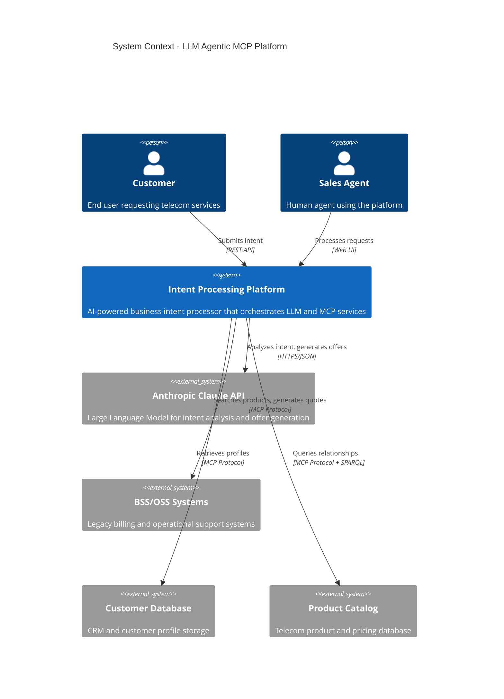
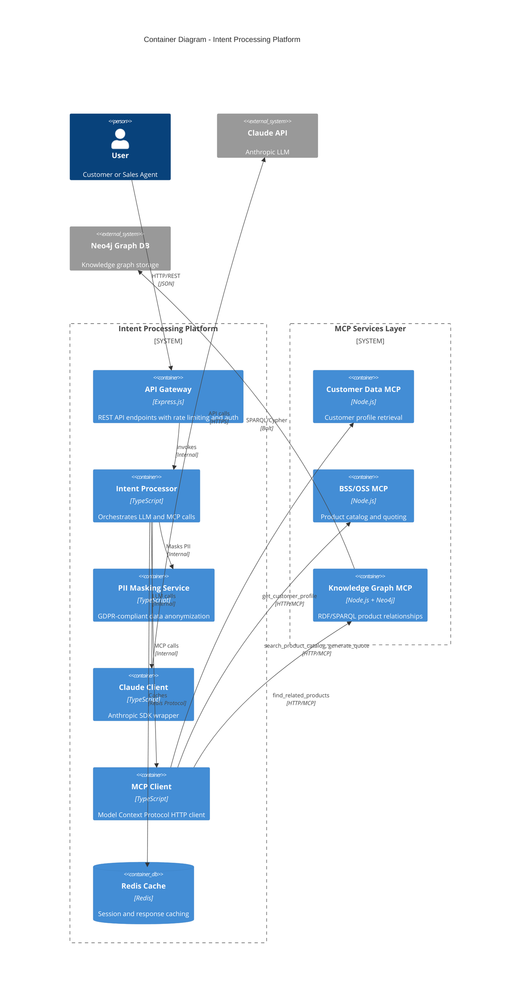
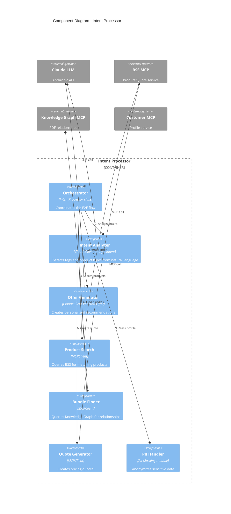
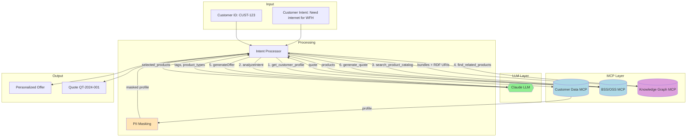

# LLM Agentic MCP - C4 Architecture Diagram

This C4 diagram shows the system context and container architecture for the LLM Agentic MCP integration.

## System Context Diagram (C4 Level 1)

## Container Diagram (C4 Level 2)

## Component Diagram (C4 Level 3) - Intent Processor

## Data Flow Diagram

## Technology Stack

| Layer | Technology | Purpose |
|-------|------------|---------|
| API | Express.js 5.x | REST endpoints |
| Orchestration | TypeScript | Intent processing logic |
| LLM | Anthropic Claude | Intent analysis, offer generation |
| MCP Protocol | @modelcontextprotocol/sdk | Tool invocation |
| Knowledge Graph | Neo4j + RDF | Product relationships |
| Caching | Redis | Response caching |
| Observability | Pino + Prometheus | Logging and metrics |
