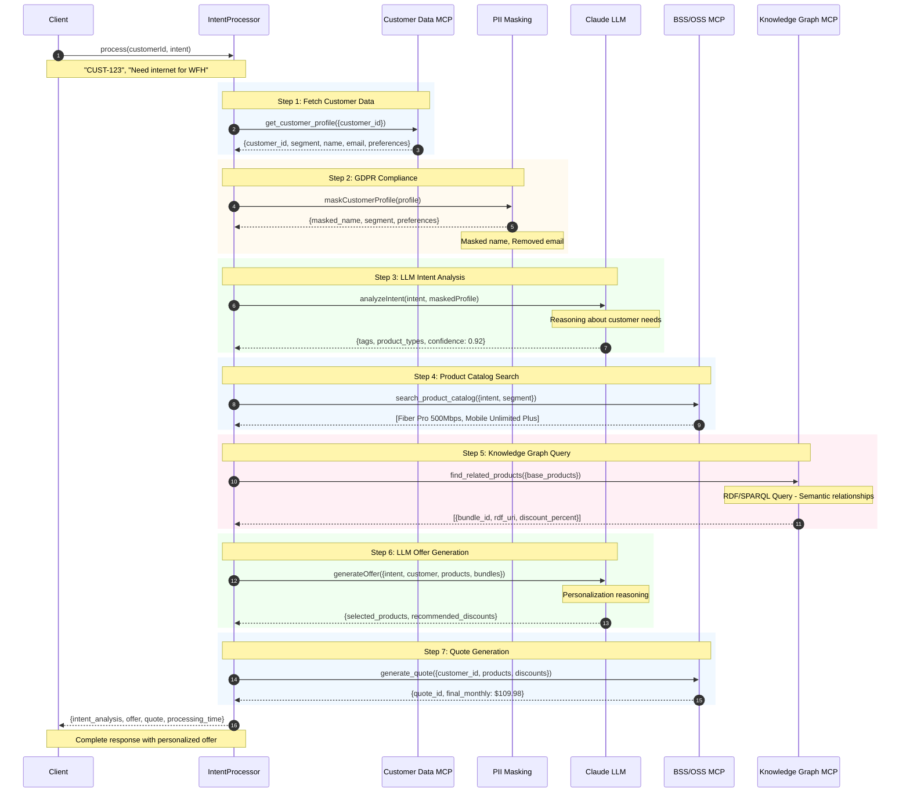

# LLM Agentic MCP - Sequence Diagram

This diagram shows the end-to-end flow of an LLM invoking Agentic MCP services to process a customer intent.

## Flow Summary

| Step | Component | Action | Purpose |
|------|-----------|--------|---------|
| 1 | Customer Data MCP | get_customer_profile | Retrieve customer context |
| 2 | PII Masking | maskCustomerProfile | GDPR compliance |
| 3 | Claude LLM | analyzeIntent | Understand customer needs |
| 4 | BSS MCP | search_product_catalog | Find matching products |
| 5 | Knowledge Graph MCP | find_related_products | Discover bundles via RDF |
| 6 | Claude LLM | generateOffer | Personalize recommendation |
| 7 | BSS MCP | generate_quote | Create pricing quote |
